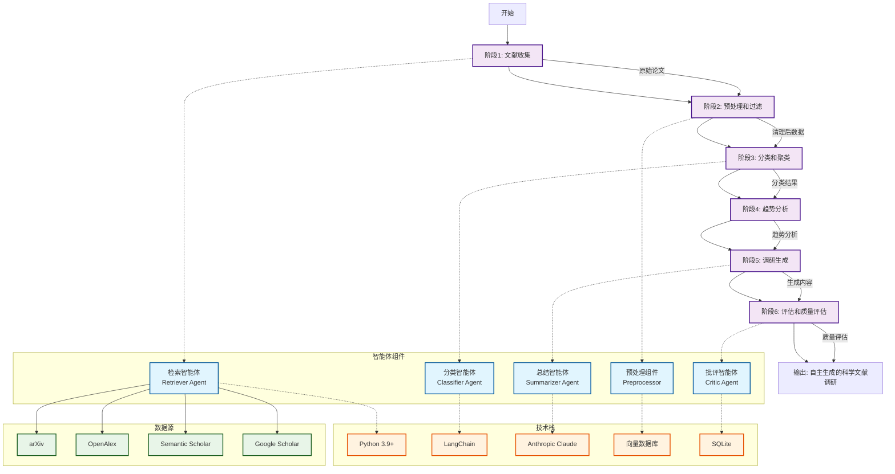
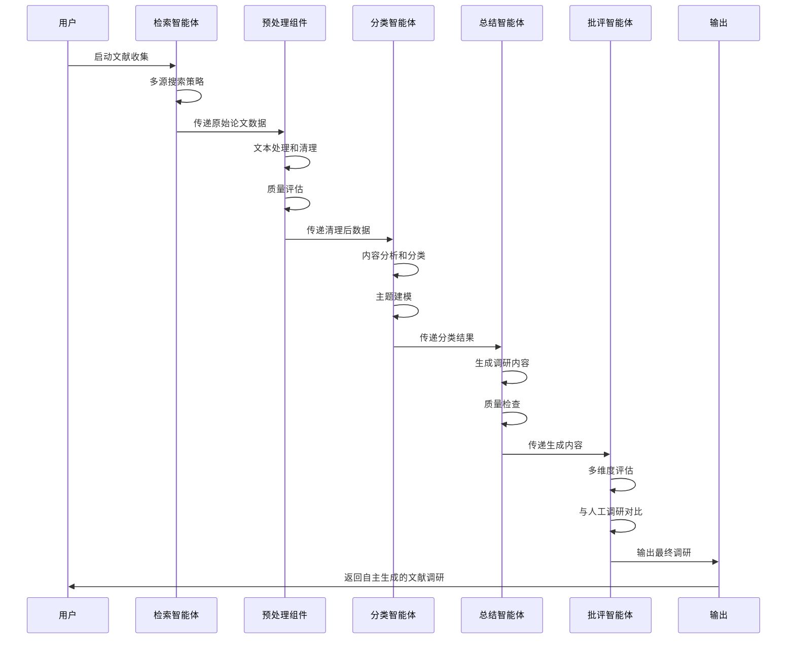
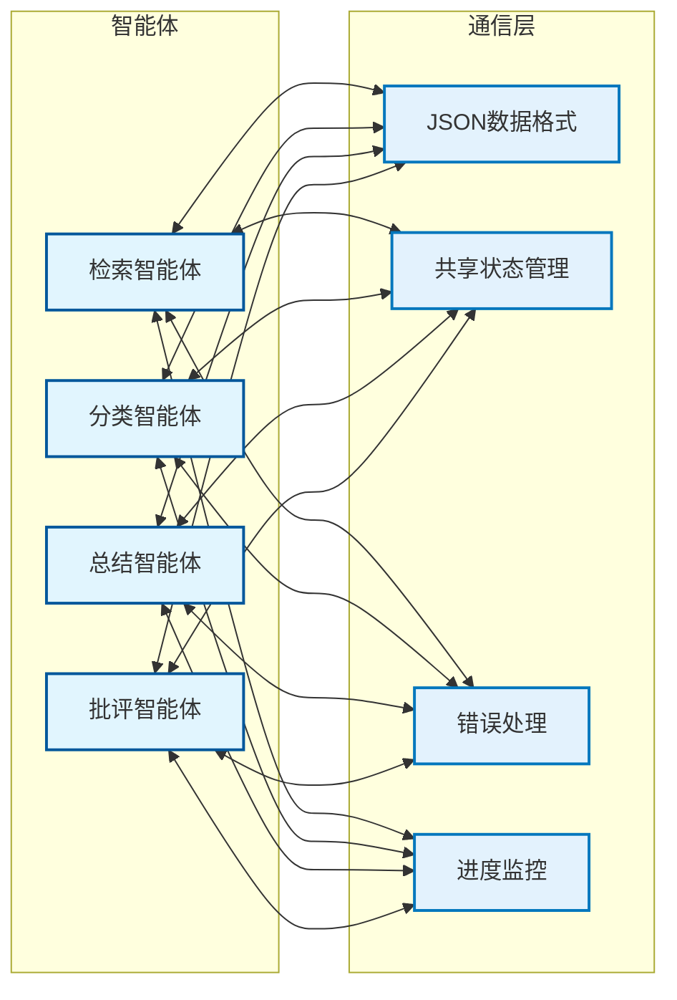

# 智能体编排管道架构图

## 当前智能体编排架构

## 智能体详细工作流程

## 智能体间通信机制

## 关键特性

### 1. 模块化设计
- 每个智能体负责特定任务
- 松耦合架构便于维护和扩展
- 可独立测试和优化各组件

### 2. 透明度和可解释性
- 完整的AI贡献声明
- 详细的流程文档
- 源追踪和引用管理
- 人工监督和验证

### 3. 质量保证
- 多维度评估指标
- 与人工调研对比
- 事实验证和一致性检查
- 持续的质量监控

### 4. 性能优化
- 批处理和平行处理
- 中间结果缓存
- API使用限制管理
- 增量更新机制

