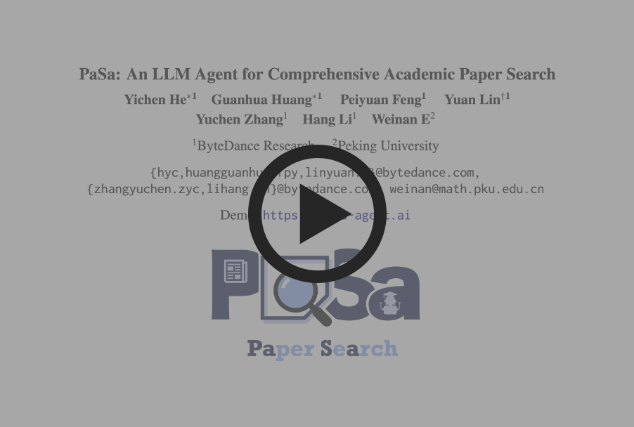
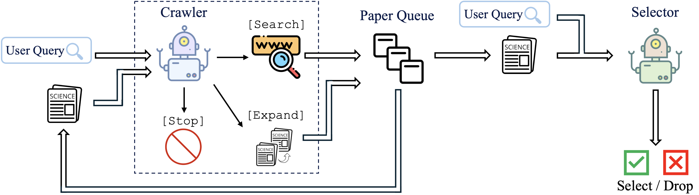
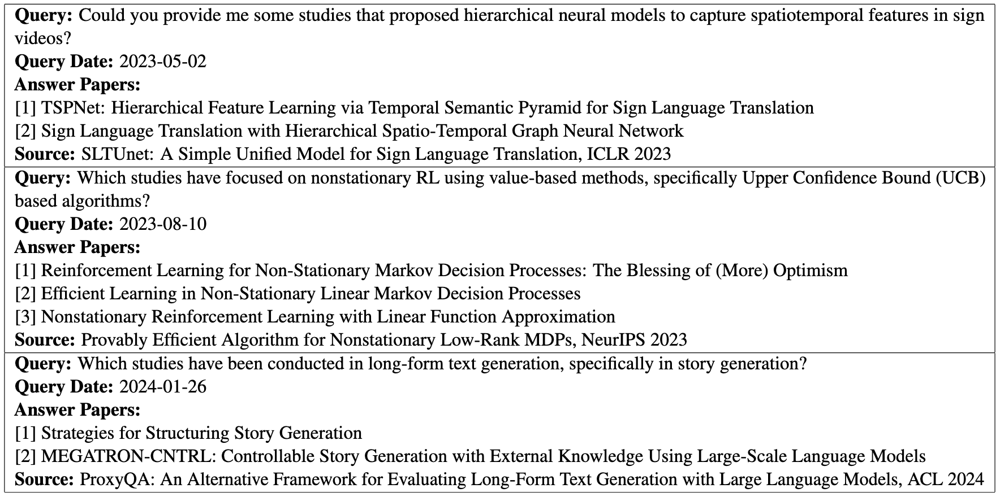
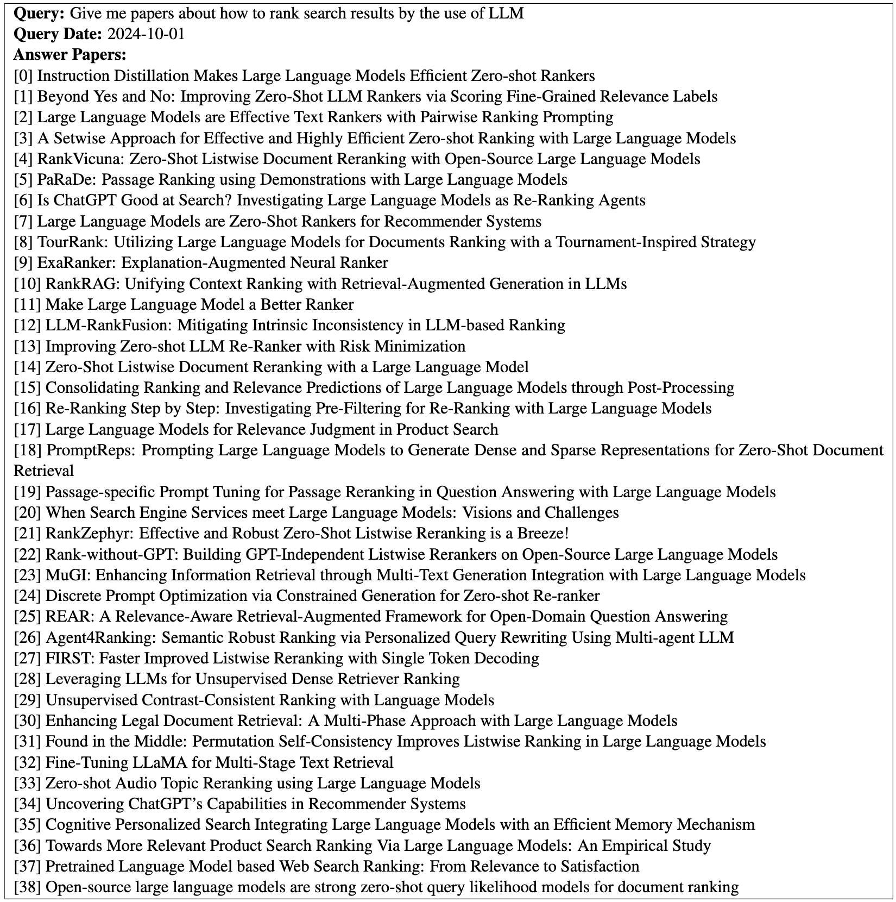
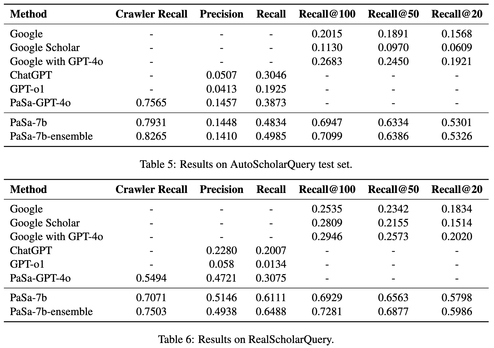

# <div align="center">PaSa: An LLM Agent for Comprehensive Academic Paper Search<br>ACL 2025 (Main)</div>
<div align="center">
    ByteDance Seed

<br>

[](https://arxiv.org/abs/2501.10120)
[](https://pasa-agent.ai)
[](https://huggingface.co/bytedance-research/pasa-7b-crawler)
[](https://huggingface.co/bytedance-research/pasa-7b-selector)
[](https://huggingface.co/datasets/CarlanLark/pasa-dataset)

  <a href="https://pasa-agent.ai">
    
  </a>
</div>

## Introduction

We introduce PaSa, an advanced **Pa**per **S**e**a**rch agent powered by large language models. PaSa can autonomously make a series of decisions, including invoking search tools, reading papers, and selecting relevant references, to ultimately obtain comprehensive and accurate results for complex scholarly queries. We optimize PaSa using reinforcement learning with a synthetic dataset, AutoScholarQuery, which includes 35k fine-grained academic queries and corresponding papers sourced from top-tier AI conference publications. Additionally, we develop RealScholarQuery, a benchmark collecting real-world academic queries to assess PaSa performance in more realistic scenarios. Despite being trained on synthetic data, PaSa significantly outperforms existing baselines on RealScholarQuery, including Google, Google Scholar, Google with GPT-4 for paraphrased queries, chatGPT (search-enabled GPT-4o), GPT-o1, and PaSa-GPT-4o (PaSa implemented by prompting GPT-4o). Notably, PaSa-7B surpasses the best Google-based baseline, Google with GPT-4o, by 37.78% in recall@20 and 39.90% in recall@50. It also exceeds PaSa-GPT-4o by 30.36% in recall and 4.25% in precision.

## Quick Start

You can prepare a detailed description of your academic search needs, and search for papers on [https://pasa-agent.ai](https://pasa-agent.ai)

[](https://www.youtube.com/watch?v=LhXCKZyriNs)

## Architecture


The PaSa system consists of two LLM agents, Crawler and Selector. The Crawler processes the user query and can access papers from the paper queue. It can autonomously invoke the search tool, expand citations, or stop processing of the current paper. All papers collected by the Crawler are appended to the paper queue. The Selector reads each paper in the paper queue to determine whether it meets the criteria specified in the user query.

## Dataset

All the datasets are available at [pasa-dataset](https://huggingface.co/datasets/CarlanLark/pasa-dataset)

### AutoScholarQuery



AutoScholarQuery is a synthetic but high-quality dataset of academic queries and related papers, specifically curated for the AI field.

### RealScholarQuery



RealScholarQuery is a test dataset consisting of 50 real-world and fine-grained research queries raised by AI researchers to use the system. The answers to each query are identified as comprehensively as possible by the professional annotators through various retrieval methods.

## Experiments

### Baselines

We evaluate our paper search agent on both the test set of AutoScholarQuery and RealScholarQuery. We compare PaSa-7b against the following baselines:

- **Google.** Use Google to search the query directly.

- **Google Scholar.** Queries are submitted directly to Google Scholar.

- **Google with GPT-4o.** We first employ GPT-4o to paraphrase the scholar query. The paraphrased query is then searched on Google.

- **ChatGPT.** We submit the scholar query to ChatGPT, powered by search-enabled GPT-4o. Due to the need for manual query submission, we evaluate only 100 randomly sampled instances from the AutoScholarQuery test set.

- **GPT-o1.** Prompt GPT-o1 to process the scholar query.

- **PaSa-GPT-4o.** Prompt GPT-4o within the PaSa framework. It can perform multiple searches, paper reading, and citation network crawling. 

### Main Results



As shown in Table 5, PaSa-7b outperforms all baselines on AutoScholarQuery test set. Specifically, compared to the strongest baseline, PaSa-GPT-4o, PaSa-7b demonstrates a 9.64% improvement in recall with comparable precision. Moreover, the recall of the Crawler in PaSa-7b is 3.66% higher than that in PaSa-GPT-4o. When compared to the best Google-based baseline, Google with GPT-4o, PaSa-7b achieves an improvement of 33.80%, 38.83% and 42.64% in Recall@20, Recall@50 and Recall@100, respectively.

We observe that using multiple ensembles of Crawler during inference can improve performance. Specifically, running Crawler twice during inference increased the Crawler recall by 3.34% on AutoScholarQuery, leading to the final recall improvement by 1.51%, with precision remaining similar. 

To evaluate PaSa in a more realistic setting, we assess its effectiveness on RealScholarQuery. As illustrated in Table 6, PaSa-7b exhibits a greater advantage in real-world academic search scenarios. Compared to PaSa-GPT-4o, PaSa-7b achieves improvements of 30.36% in recall and 4.25% in precision. Against the best Google-based baseline on RealScholarQuery, Google with GPT-4o, PaSa-7b outperforms Google by 37.78%, 39.90%, and 39.83% in recall@20, recall@50 and recall@100, respectively. Additionally, the PaSa-7b-ensemble further enhances crawler recall by 4.32%, contributing to an overall 3.52% improvement in the recall of the entire agent system.

## Run Locally

### Data Preparation

Download dataset from [pasa-dataset](https://huggingface.co/datasets/CarlanLark/pasa-dataset) and save it in the data folder.

```
pasa/data
├── AutoScholarQuery
│   ├── dev.jsonl
│   ├── test.jsonl
│   └── train.jsonl
├── paper_database
│   ├── cs_paper_2nd.zip
│   └── id2paper.json
├── RealScholarQuery
│   └── test.jsonl
├── sft_crawler
│   └── train.jsonl
└── sft_selector
    ├── test.jsonl
    └── train.jsonl
```

### Model Preparation

Download model checkpoints [pasa-7b-crawler](https://huggingface.co/bytedance-research/pasa-7b-crawler) and [pasa-7b-selector](https://huggingface.co/bytedance-research/pasa-7b-selector) and save it in the checkpoints folder.

```
pasa/checkpoints
├── pasa-7b-crawler
└── pasa-7b-selector
```

### Run Pasa

```bash
git clone git@github.com:hyc2026/transformers.git
cd transformers
pip install -e .
cd ..
pip install -r requirements.txt
```

You need to first apply for a Google Search API key at [serper.dev](https://serper.dev/), and replace 'your google keys' in `utils.py`.

```python
python run_paper_agent.py
```
- The `crawler` generates the search queries from the user query and choose the expand sections from ll secondary section names of the paper.
- The `selector` takes the title and abstract of the paper as input and generates a score which indicates the relevance between the paper and user query.
- We also use google search api to search the queries generated by the `crawler` and use arxiv/ar5iv search api to get the complete paper.

## Training Your Own Agent

We modify the code of `trl` and `transformers`, you can do SFT and PPO training after cloning and installing them.

[https://github.com/hyc2026/trl](https://github.com/hyc2026/trl) \
[https://github.com/hyc2026/transformers](https://github.com/hyc2026/transformers)

### Install dependencies
```bash
git clone git@github.com:hyc2026/trl.git
cd trl
pip install -e .
cd ..
git clone git@github.com:hyc2026/transformers.git
cd transformers
pip install -e .
cd ..
pip install -r requirements.txt
```

### Selector SFT Training

```bash
cd trl
accelerate launch \
    --config_file examples/accelerate_configs/deepspeed_zero3.yaml \ 
    --num_processes 8 \
    --main_process_port 2501 \
    --machine_rank 0 \
    --main_process_ip 127.0.0.1 \
    examples/scripts/sft.py \
    --model_name_or_path Qwen2.5-7B-Instruct \
    --dataset_name ../data/sft_selector/train.jsonl \
    --learning_rate 1.0e-5 \
    --num_train_epochs 1 \
    --bf16 True \
    --per_device_train_batch_size 4 \
    --gradient_accumulation_steps 1 \
    --gradient_checkpointing \
    --logging_steps 50 \
    --save_steps 2000 \
    --max_seq_length 1024 \
    --weight_decay 0.01 \
    --warmup_ratio 0.01 \
    --output_dir ../results/sft_selector \
    --attn_implementation "flash_attention_2"
```

### Crawler SFT Training
```bash
cd trl
accelerate launch \
    --config_file examples/accelerate_configs/deepspeed_zero3.yaml \ 
    --num_processes 8 \
    --main_process_port 2501 \
    --machine_rank 0 \
    --main_process_ip 127.0.0.1 \
    examples/scripts/sft.py \
    --model_name_or_path Qwen2.5-7B-Instruct \
    --dataset_name ../data/sft_crawler/train.jsonl \
    --learning_rate 1.0e-5 \
    --num_train_epochs 1 \
    --bf16 True \
    --per_device_train_batch_size 4 \
    --gradient_accumulation_steps 1 \
    --gradient_checkpointing \
    --logging_steps 50 \
    --save_steps 2000 \
    --max_seq_length 1024 \
    --weight_decay 0.01 \
    --warmup_ratio 0.01 \
    --output_dir ../results/sft_crawler \
    --attn_implementation "flash_attention_2"
```

### Crawler PPO Training

**Before Training:**

1. You need to first apply for a Google Search API key at [serper.dev](https://serper.dev/), and replace the 'your google keys' in `trl/custom_agent/search_tools.py`.
2. If you set `use_selector=True`, you need to deploy additional selector models, which can be accessed during training. Please modify `call_selector` function in `trl/custom_agent/utils.py` to call the selector and get the select results.

```bash
cd trl
accelerate launch \
    --config_file examples/accelerate_configs/deepspeed_zero3_multi.yaml \
    --main_process_port 2501 \
    --machine_rank 0 \
    --main_process_ip 127.0.0.1 \
    examples/scripts/ppo/ppo_tldr.py \
    --dataset_name ../data/AutoScholarQuery/train.jsonl \
    --dataset_test_split validation \
    --output_dir ../results/ppo_crawler \
    --learning_rate 1e-6 \
    --per_device_train_batch_size 1 \
    --gradient_accumulation_steps 4 \
    --total_episodes 16000 \
    --paper_db ../data/paper_database/cs_paper_2nd.zip \
    --paper_id ../data/paper_database/id2paper.json \
    --model_name_or_path ../output/sft_crawler \
    --sft_model_path ../output/sft_crawler \
    --reward_model_path ../output/sft_crawler \
    --local_rollout_forward_batch_size 4 \
    --num_sample_generations 0 \
    --attn_implementation "flash_attention_2" \
    --response_length 1024 \
    --stop_token eos \
    --gamma1 0.1 \
    --save_steps 10 \
    --rounds 3 \
    --use_vm True \
    --use_selector True \
    --vf_coef 10.0 \
    --expand_select_score 1.5 \
    --expand_cost 0.1 \
    --search_select_score 1.5 \
    --search_cost 0.1 \
    --num_ppo_epochs 2 \
    --kl_coef 0.1
```

## Citation
Please cite us as:

```BibTeX
@misc{he2024pasa,
      title={PaSa: An LLM Agent for Comprehensive Academic Paper Search}, 
      author={Yichen He and Guanhua Huang and Peiyuan Feng and Yuan Lin and Yuchen Zhang and Hang Li and Weinan E},
      year={2025},
      eprint={2501.10120},
      archivePrefix={arXiv},
      primaryClass={cs.IR}
}
```
